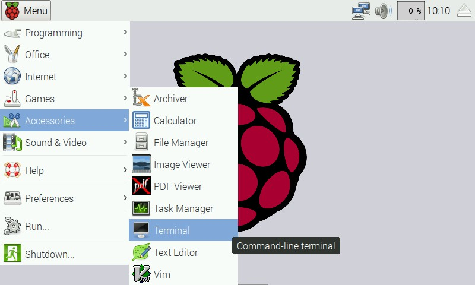

This repository contains libraries and examples for the Pimoroni Skywriter boards.

Compatible with:

* Skywriter - https://shop.pimoroni.com/products/skywriter?variant=1047423445
* Skywriter HAT - https://shop.pimoroni.com/products/skywriter-hat?variant=1002848445

## Installing Software

### One-line Installer

We've created a super-easy installation script that will install all pre-requisites and get your HAT up and running in a jiffy. To run it fire up Terminal which you'll find in Menu -> Accessories -> Terminal on your Raspberry Pi desktop like so:



In the new terminal window type the following and follow the instructions:

```
curl -sS get.pimoroni.com/skywriter | bash
```

### From PyPi (Stable)

Install `smbus`:

```
sudo apt install python3-smbus
```

Enable i2c:

```
sudo raspi-config nonint do_i2c 0
```

Install the library:

```
python3 -m pip install skywriter
```

### From Source (Unstable/Latest)

Install `smbus`:

```
sudo apt install python3-smbus
```

Enable i2c:

```
sudo raspi-config nonint do_i2c 0
```

Install the library:

```
git clone https://github.com/pimoroni/skywriter-hat
cd skywriter-hat/python/library
python3 setup.py install
```

## Documentation & Support

* Function reference - http://docs.pimoroni.com/skywriter/
* GPIO Pinout - https://pinout.xyz/pinout/skywriter_hat
* Get help - http://forums.pimoroni.com/c/support

## Skywriter to Pi Connection

You can use a full-sized Skywriter board with your Raspberry Pi and our library by mimicking the connections that the HAT users. They are as follows:

Skywriter  | Raspberry Pi
-----------|--------------
GND        | GND
TRFR       | GPIO 27
RESET      | GPIO 17
SCL        | GPIO 3 / SCL
SDA        | GPIO 2 / SDA
VCC        | 3V
